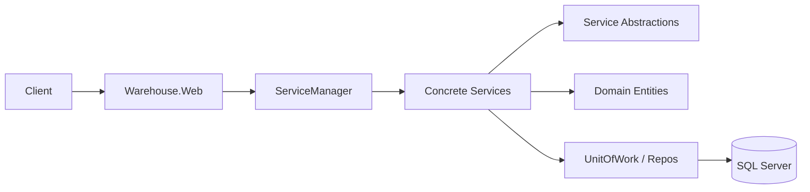
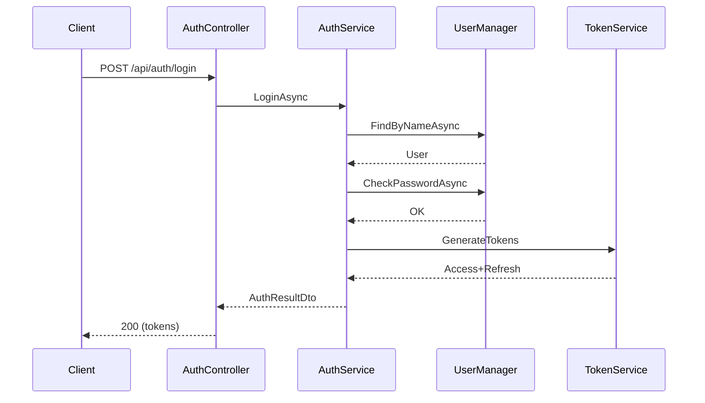

# Warehouse Management API

A modular, layered ASP.NET Core 8 Web API for managing warehouses system. It demonstrates clean architectural layering, separation of concerns, and reusable service abstractions.

## Goals
- Showcase maintainable domain-centric design
- Provide extensible CRUD + domain workflows (inventory transactions, defective items, transfers)
- Illustrate application of common software engineering principles & patterns in .NET

## Core Engineering Principles
- Single Responsibility: Each project and service has a focused purpose
- Separation of Concerns: Web, services, domain, persistence, DTOs isolated
- Dependency Inversion: Higher layers depend on abstractions (service & repo interfaces)
- DRY / Reuse: Generic service & controller patterns reduce duplication
- Explicit Boundaries: Domain layer free of infrastructure details
- Fail Fast & Clear Contracts: DTOs + interfaces define intent and shape communication

## Applied Design Patterns
| Pattern | Location / Example | Purpose |
|---------|--------------------|---------|
| Layered Architecture | Project structure | Organize responsibilities (Presentation -> Services -> Persistence -> DB) |
| Repository | Persistence layer (repositories behind UnitOfWork) | Abstract EF Core data access |
| Unit of Work | IUnitOfWork implementation | Coordinate transactional SaveChanges |
| Generic Service | GenericService<TEntity,CreateDto,ViewDto,TKey> | Reusable CRUD orchestration |
| Facade | ServiceManager | Single entry point aggregating domain services |
| DTO / Mapper | Shared DTOs + AutoMapper profiles | Decouple API contracts from entities |
| Strategy (implicit) | Token generation via ITokenService | Encapsulate token creation details |
| Middleware | CustomExceptionHandler | Centralize exception -> response translation |
| Enumeration as Type | TransactionTypes enum | Express intent instead of magic values |
| Dependency Injection | ApplicationServiceRegistration | Inversion of control & testability |

## Solution Structure
| Project | Responsibility |
|---------|----------------|
| Core/DomainLayer | Domain entities & enums (pure business model) |
| Core/ServiceAbstraction | Service interfaces, generic contracts, service manager interface |
| Core/Contracts ("Service") | Concrete service implementations (Auth, Product, Inventory, Party, Role, etc.) |
| Infrastructure/Persistence | EF Core DbContext, repositories, UnitOfWork |
| Infrastructure/Presentation | Controllers / presentation helpers (if added) |
| Warehouse.Web | Composition root (DI, middleware, hosting, Swagger, Identity, JWT) |
| Shared | DTOs, enums, cross-cutting simple types |

## High-Level Architecture


## Domain Highlights
- InventoryTransaction links Product, Warehouse, User (CreatedBy)
- Invoice ties Customer + Supplier + CreatedBy
- Defective product registration & transfer workflow (via ProductService)
- User extends IdentityUser with activation & refresh token reference

## Request Flow (Example: Create Inventory Transaction)
1. Controller receives CreateInventoryTransactionDto
2. Delegates to InventoryService (specialized generic service)
3. Service validates references & adjusts stock
4. UnitOfWork commits changes through EF Core
5. Returns ViewInventoryTransactionDto to caller

## Authentication (Overview)
- IdentityCore<User, Role>
- JWT bearer configured (issuer/audience/key via configuration)
- RefreshToken navigation property for renewal scenario

## AutoMapper Profiles
Profiles live with service implementations (close to transformation logic) for: Products, Employees, Warehouses, Inventory Transactions, etc.

## Running the Project
### Prerequisites
- .NET 8 SDK
- SQL Server instance

### Setup & Run
```bash
dotnet build
dotnet run --project Warehouse.Web/Warehouse.Web.csproj
```
Navigate to Swagger UI (shown launch URL) for interactive exploration.

### Migrations (if schema not created)
```bash
dotnet tool install --global dotnet-ef
# Create (example)
dotnet ef migrations add InitialCreate -p Infrastructure/Persistence/Persistence.csproj -s Warehouse.Web/Warehouse.Web.csproj
# Apply
dotnet ef database update -p Infrastructure/Persistence/Persistence.csproj -s Warehouse.Web/Warehouse.Web.csproj
```

## Extensibility Examples
| Extension | Approach |
|-----------|----------|
| New entity CRUD | Create entity + DTOs + AutoMapper profile -> register IGenericService usage |
| Domain rule | Add method / validation inside specific service before commit |
| Additional projection | Add mapping + query variant (e.g., lightweight list DTO) |
| Caching layer | Decorate selected service interfaces (not yet implemented) |

## Why Generic Services?
Avoid repetitive CRUD code (Add, Update, Delete, Get) while preserving ability to extend specialized behavior (InventoryService example).

## Why a ServiceManager?
Simplifies controller constructor signatures and groups service dependencies behind a single facade, improving evolvability.

## Simplified Login Sequence


## Keeping It Maintainable
- Keep domain logic in services (not controllers)
- Add focused tests per service (mock repositories / token service)
- Favor small, composable DTOs
- Evolve mappings vs exposing entities directly

## Next Logical Enhancements (Engineering Focus)
- Introduce Specifications for complex querying
- Add validation layer (e.g., FluentValidation) before service calls
- Introduce domain events for significant state changes (e.g., low stock)
- Add interface-based decorators (logging, caching, metrics)

## Detailed Diagrams & Patterns
See: docs/architecture.md
