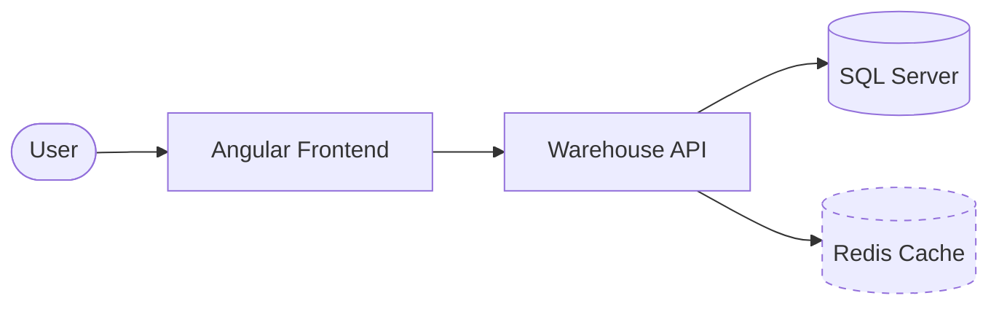
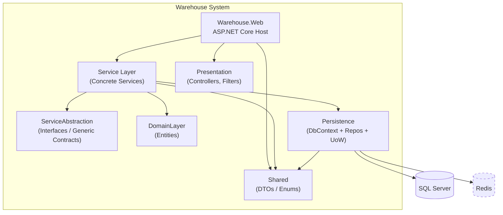
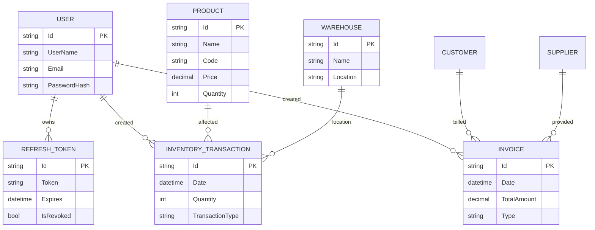
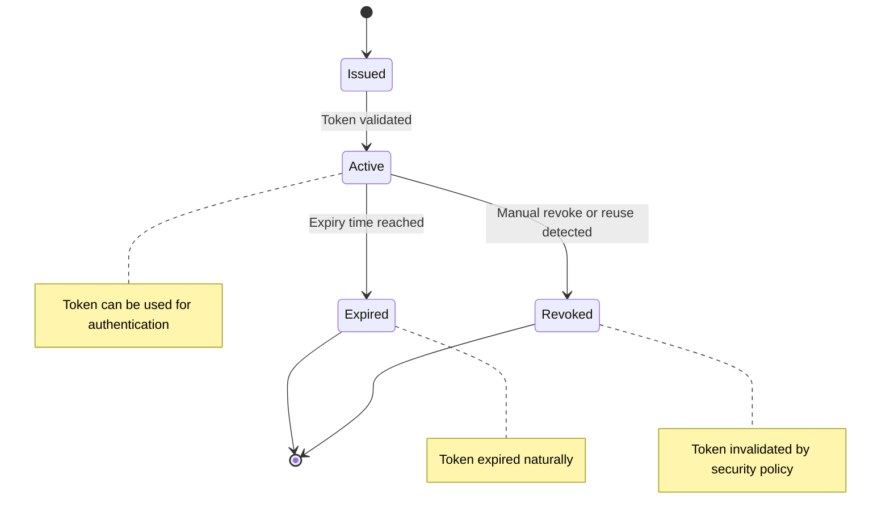

# Architecture Deep Dive

## 1. C4 Model (Simplified)

### Context


### Containers


## 2. Project Coupling Rules

| From | May Reference | Must Not Reference |
|------|---------------|--------------------|
| Warehouse.Web | Service, Persistence, Presentation, Shared | Nothing higher |
| Infrastructure.Persistence | DomainLayer, Contracts(Service), Shared | Web |
| Core.Contracts (Service impl) | DomainLayer, ServiceAbstraction, Shared | Web directly |
| ServiceAbstraction | DomainLayer, Shared | Concrete Service implementations |
| DomainLayer | Shared (light usage) | Persistence, Web |
| Shared | (Ideally none) | Business logic |

## 3. Entity Relationship (Excerpt)


## 4. Service Layer Patterns

- GenericService<TEntity, CreateDto, ViewDto, TKey>
  - Basic CRUD orchestration
  - Mapping via AutoMapper
- Specialized services (e.g., InventoryService) encapsulate domain-specific workflows.
- ServiceManager acts as a facade aggregating service interfaces for simpler dependency injection.

## 5. Persistence

- UnitOfWork coordinates repository commits.
- Repositories wrap EF Core DbSets.
- Lazy loading proxies enabled (be mindful of serialization cycles; DTO mapping mitigates risk).
- Migrations keep schema in sync.

## 6. Identity & Security

- ASP.NET Core Identity Core with custom User and Role entities.
- Password policy currently minimal (adjust for production hardening).
- JWT tokens configured with issuer, audience, symmetric key.
- RefreshToken entity supports rolling refresh token strategy.

## 7. AutoMapper

- Profiles reside in Service project (close to use-cases).
- Registered in ApplicationServiceRegistration (assembly scan pattern).
- Prefer projection (ProjectTo) for large list endpoints.

## 8. Error Handling

- CustomExceptionHandler middleware centralizes exception translation.
- Extend with correlation IDs & structured logging (Serilog recommended).

## 9. Caching (Planned)

1. Introduce ICacheService abstraction.
2. Implement Redis-backed provider.
3. Decorate high-read services (e.g., product catalog) with caching layer.
4. Add cache invalidation on write operations.

## 10. Extensibility Points

| Need | Approach |
|------|----------|
| Auditing | Override SaveChanges or interceptors |
| Soft Delete | Add IsDeleted + EF query filters |
| Domain Events | Aggregate domain events + outbox table |
| Multi-Tenancy | TenantId columns + global filters |
| CQRS | Introduce MediatR for command/query segregation |
| Background Jobs | Hosted Services / Hangfire |

## 11. Performance Considerations

| Area | Strategy |
|------|----------|
| N+1 Queries | Prefer eager loading or projection |
| Large Payloads | Pagination & filtering |
| Serialization | DTO mapping avoids circular refs |
| Concurrency | Add optimistic concurrency tokens |

## 12. Testing Strategy (Proposed)

| Test Type | Focus |
|-----------|-------|
| Unit | Service logic & edge cases |
| Integration | EF Core (SQLite/InMemory) + repository behavior |
| API | Full request pipeline via WebApplicationFactory |
| Security | Auth & authorization policy coverage |

## 13. Deployment Notes

- Add Dockerfile (multi-stage: build -> runtime).
- Apply migrations at startup or via CI pipeline step.
- Externalize secrets (env vars / vault).
- Add health & readiness endpoints.

## 14. Sample Migration Command
```
dotnet ef migrations add AddInventoryModule -p Infrastructure/Persistence/Persistence.csproj -s Warehouse.Web/Warehouse.Web.csproj
```

## 15. Refresh Token Lifecycle


## 16. Future Enhancements

- Low stock domain events & notifications.
- Metrics & distributed tracing (OpenTelemetry).
- Policy-based fine-grained permissions.
- GraphQL endpoint for advanced querying.
- Reporting / BI integration.

## 17. Code Style Guidelines

- Entities: PascalCase properties; keep navigation virtual if lazy loading.
- DTO suffix: Dto.
- Async suffix for async methods.
- Avoid leaking EF entities beyond service layer (use DTOs).

## 18. Risks & Mitigations

| Risk | Mitigation |
|------|-----------|
| Refresh token theft | Rotate on each use & detect reuse |
| Performance drag from lazy loading | Switch to explicit eager loading for hot paths |
| Key compromise | Rotate SecretKey & use Azure Key Vault |
| Missing validation layer | Add FluentValidation or DataAnnotations enforcement |

## 19. Production Hardening Checklist

- Strengthen password & lockout policies.
- Enforce HTTPS + HSTS.
- Add structured logging + log retention policy.
- Add rate limiting.
- Add input validation layer.
- Security headers (Content-Security-Policy, etc.).
- Monitoring: Alerts on error rate, latency, auth failures.

---
Document reflects current architecture; update as system evolves.
